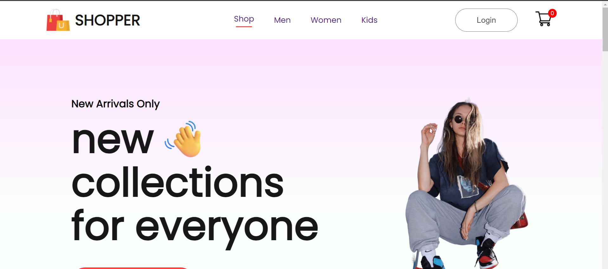
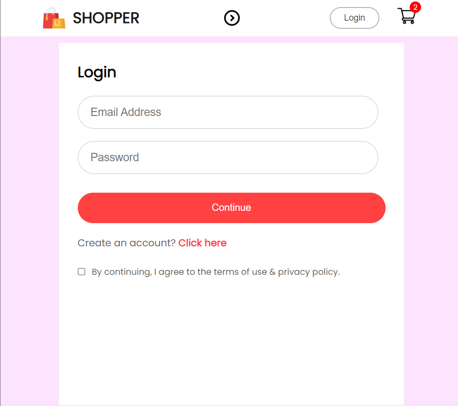
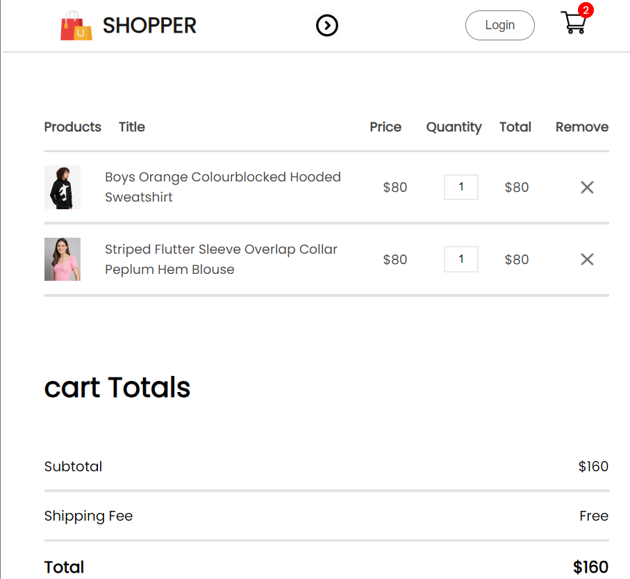
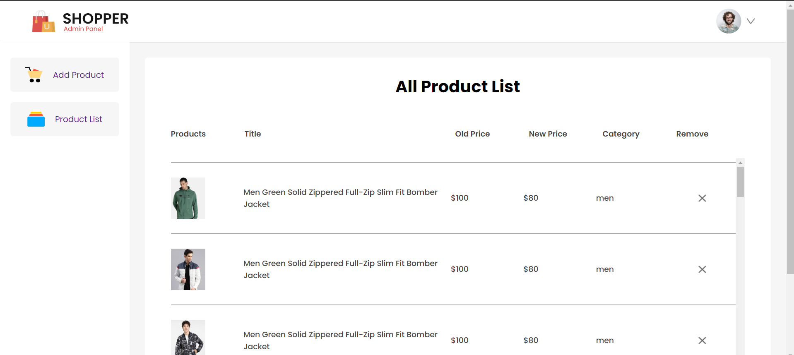

# Ecommerce Website - MERN Stack

## Overview

It is an ecommerce website developed using the MERN (MongoDB, Express.js, React, Node.js) stack. The data is stored in MongoDB Atlas, a cloud-based database service.

## Features

- User authentication and authorization
- Product listing and details
- Shopping cart functionality
- Checkout process
- Admin panel for managing products and orders

## Technologies Used

- MongoDB Atlas: Cloud-based NoSQL database
- Express.js: Backend web application framework for Node.js
- React: Frontend library for building user interfaces
- Node.js: JavaScript runtime for server-side development
- Redux: State management library for React
- JWT (JSON Web Tokens): Used for authentication

## Prerequisites

- Node.js and npm installed
- MongoDB Atlas account for database access
- Clone this repository

## Setup

1. Install dependencies for both client and server:

```bash
cd client
npm install

cd ../server
npm install
```
## Home



## login


## cart


## admin

